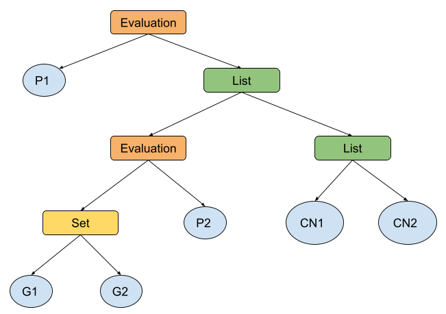

# Distributed Atom Space (DAS)

### Description:

This repo aims to develop a new design to store all the MeTTa expressions in a database to be accessed through an API.
Our first approach is using MongoDB (expressions) + Couchbase (indexes).

### Examples:

As a simple example, we have the following expression:

```
(: Evaluation Type)
(: Predicate Type)
(: Reactome Type)
(: Concept Type)
(: "Predicate:has_name" Predicate)
(: "Reactome:R-HSA-164843" Reactome)
(: "Concept:2-LTR circle formation" Concept)
(
	Evaluation 
	"Predicate:has_name" 
	(
	    Evaluation 
	    "Predicate:has_name" 
	    {"Reactome:R-HSA-164843" "Concept:2-LTR circle formation"}
	)
)
```

#### MongoDB:

The `_id` must be built by hashing (`sha256`) the documents' fields to avoid duplication. For simplicity, we'll be using
integers on this example.

```
NodeTypes: [
    { _id: 1, type: null, name: "Unknown" },
    { _id: 2, type: null, name: "Type" },
    { _id: 3, type: 2, name: "Evaluation" },
    { _id: 4, type: 2, name: "Predicate" },
    { _id: 5, type: 2, name: "Reactome" },
    { _id: 6, type: 2, name: "Concept" },
]

Nodes: [
    { _id: 7, type: 4, name: "Predicate:has_name" },
    { _id: 8, type: 5, name: "Reactome:R-HSA-164843" },
    { _id: 9, type: 6, name: "Concept:2-LTR circle formation" },
]

Links_1: [{}]

Links_2: [
    {
	    _id: 10,
	    is_ordered: false,
	    is_root: false,
	    type: {Reactome, Concept},
	    key1: 8,
	    key2: 9,
    },
]

Links_3: [
    {
	    _id: 11,
	    is_ordered: true,
	    is_root: false,
	    type: [Type, Predicate, {Reactome, Concept}],
	    key1: 3,
	    key2: 7,
	    key3: 10,
    },
    {
	    _id: 12,
	    is_ordered: true,
	    is_root: true,
	    type: [Type, Predicate, [Type, Predicate, {Reactome, Concept}]],
	    key1: 3,
	    key2: 7,
	    key3: 11,
    },
]
```

As an example of how `sha256` will be used here:

```
    _id: XX ->  sha256(sha256(type), sha256(key1), sha256(key2), ...)
    _id: 10 ->  sha256(sha256(set_salt, 5, 6), 8, 9)
    _id: 11 ->  sha256(sha256(2, 4, sha256(set_salt, 5, 6)), 3, 7, 10)
    _id: 12 ->  sha256(sha256(2, 4, sha256(2, 4, sha256(set_salt, 5, 6))), 3, 7, 11)
```

Notes:

- We do NOT use `is_root` and `is_ordered` fields on hashing.
- For set expressions (`{ ... }`) we add a `salt` to the hash calculation.

#### Couchbase:

```
IncomingSet:
{
     8: [10],
     9: [10],
     3: [11, 12],
     7: [11, 12],
    10: [11],
    11: [12]
}

RecursiveIncomingSet:
{
     8: [10, 11, 12],
     9: [10, 11, 12],
     3: [11, 12],
     7: [11, 12],
    10: [11, 12],
    11: [12]
}

OutgoingSet:
{
    10: [8, 9],
    11: [3, 7, 10],
    12: [3, 7, 11]
}

RecursiveOutgoingSet:
{
    10: [8, 9],
    11: [3, 7, 10, 8, 9],
    12: [3, 7, 11, 10, 8, 9]
}
```

Here is another simple example to show how we create a graph from an expression:

```
(
    Evaluation
        "Predicate:P1"
        (
            (Evaluation "Predicate:P2" {"Gene:G1" "Gene:G2"})
            ("Concept:CN1" "Concept:CN2")
        )
)
```



### Datasets:

You can find all the Atomese (`.scm`) files
from [gene-level-dataset_2020-10-20](https://mozi.ai/datasets/gene-level-dataset_2020-10-20/)
already translated to MeTTa (`.metta`) in the [data/bio_atomsapace](./data/bio_atomspace) directory.

The translation script used is in [scripts/atomese2metta](./scripts/atomese2metta).

### Get it started:

Go to [scripts/](./scripts) directory to get info about how to set up the necessary environment.
