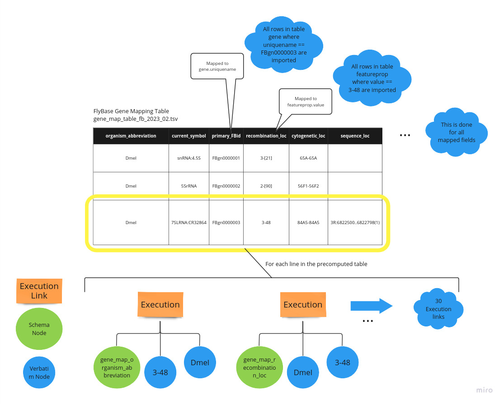

# FlyBase in Distributed Atom Space

In this directory we have the required tools to download and convert FlyBase files to MeTTa input which can be read by the DAS parser.

See the [FlyBase site](https://flybase.org/) for information on the actual data.

## Dowloading a FlyBase release

There's a script `fetch_flybase_release.sh` to fetch a specific release of FlyBase. It can't recognize the most recent release automatically so if you want to download the most recent release you must first go to the site and find out the release tag. A release tag is a string like `2022_06` which the year and the month of the release.

The script downloads a (huge) SQL file with all FlyBase tables and their entries and a given set of CSVs, TSVs etc (we use the term `precomputed` to refer to these files) generated automatically by scripts in the FlyBase host whenever a new release is made public. See [this link](https://wiki.flybase.org/wiki/FlyBase:Downloads_Overview) for a detailed description of such files, and [this link](https://github.com/FlyBase/harvdev-bulk-reports#GoCDPipeline) for information about the scripts used to generate them.

The script expects two arguments: the release tag and a target directory where data will be downloaded to.

```
$ cd flybase2metta
$ ./fetch_flybase_release.sh 2023_02 /tmp/flybase
```

After a couple of minutes you have the last released SQL file with all the FlyBase and a set of files with the precomputed tables.

```
$ ls /tmp/flybase/2023_02
FB2023_02.sql.gz  precomputed
$
$ ls /tmp/flybase/2023_02/precomputed/
allele_genetic_interactions_fb_2023_02.tsv.gz
disease_model_annotations_fb_2023_02.tsv.gz
dmel_gene_sequence_ontology_annotations_fb_2023_02.tsv.gz
dmel_human_orthologs_disease_fb_2023_02.tsv.gz
fbgn_fbtr_fbpp_expanded_fb_2023_02.tsv.gz
fbrf_pmid_pmcid_doi_fb_2023_02.tsv.gz
gene_association.fb.gz
gene_genetic_interactions_fb_2023_02.tsv.gz
gene_map_table_fb_2023_02.tsv.gz
ncRNA_genes_fb_2023_02.json.gz
physical_interactions_mitab_fb_2023_02.tsv.gz
```

You need to `gunzip` all files before proceeding.

## Converting FlyBase data to MeTTa

FlyBase data is a huge SQL file and a set of TSV, JSON, etc files. Before using them to feed a Distributed Atom Space we need to convert them to MeTTa. There's a Python script `sql_reader.py` to do this.

You need to edit the script and change a couple of global variables.

```
SQL_FILE = "/tmp/flybase/2023_02/FB2023_02.sql"
PRECOMPUTED_DIR = "/tmp/flybase/2023_02/precomputed"
OUTPUT_DIR = "/tmp/flybase_metta"
```

`sql_reader.py` will try to map columns from precomputed tables to columns in the SQL schema in order to enhance the MeTTa knowledge base with more links. This step is computationally expensive and usually requires further by-hand fine tuning. That's why we have a variable:

```
SKIP_PRECOMPUTED_MATCH_BUILD = True
```

set to `True` by default. Instead of computing this mapping you can just reuse the mapping in `mapping.txt`:

```
$ cp mapping.txt /tmp/flybase/2023_02/precomputed/
```

You can safely disregard all the other global variables in `sql_reader.py`.

Run the script by calling:

```
$ python3 sql_reader.py
```

## Mapping FlyBase data into nodes and links

The precomputed tables define which information will be translated to MeTTa and later imported into the Distributed Atom Space. All precomputed tables are imported as illustrated below.
Each row of each table become a set of Execution links linking all values taken 2-2.



Mapped fields determine which rows of which tables will also be translated from the SQL file. Basically, every row in every table whose values have been "mentioned" in some of the precomputed tables is fully imported according to the schema below.


